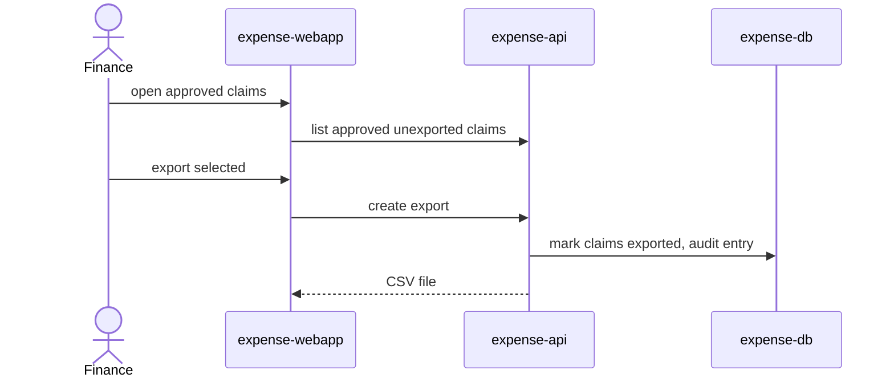

# Export approved claims

A finance user selects approved, not-yet-exported claims and downloads a CSV; the claims are marked exported.

```mermaid
sequenceDiagram
    actor Finance
    participant expense-webapp
    participant expense-api
    participant expense-db

    Finance->>expense-webapp: open approved claims
    expense-webapp->>expense-api: list approved unexported claims
    Finance->>expense-webapp: export selected
    expense-webapp->>expense-api: create export
    expense-api->>expense-db: mark claims exported, audit entry
    expense-api-->>expense-webapp: CSV file
```