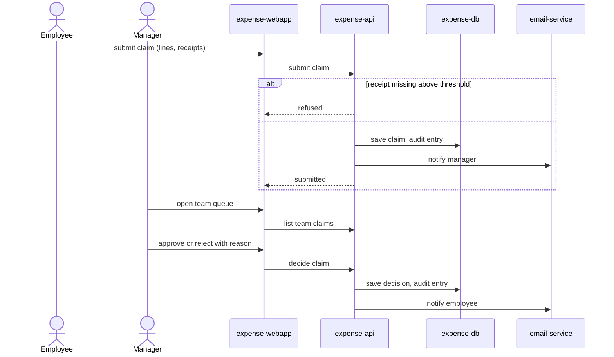

# Submit and approve a claim

An employee submits a claim; the line manager is emailed and approves or rejects it; the employee is emailed the outcome.

```mermaid
sequenceDiagram
    actor Employee
    actor Manager
    participant expense-webapp
    participant expense-api
    participant expense-db
    participant email-service

    Employee->>expense-webapp: submit claim (lines, receipts)
    expense-webapp->>expense-api: submit claim
    alt receipt missing above threshold
        expense-api-->>expense-webapp: refused
    else
        expense-api->>expense-db: save claim, audit entry
        expense-api->>email-service: notify manager
        expense-api-->>expense-webapp: submitted
    end
    Manager->>expense-webapp: open team queue
    expense-webapp->>expense-api: list team claims
    Manager->>expense-webapp: approve or reject with reason
    expense-webapp->>expense-api: decide claim
    expense-api->>expense-db: save decision, audit entry
    expense-api->>email-service: notify employee
```